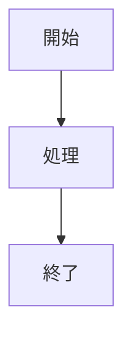

# Slidev Templates

## 基本構造

```md
---
theme: default
title: プレゼンテーションタイトル
info: |
  プレゼンテーションの説明
author: 作成者名
keywords: キーワード1, キーワード2
transition: slide-left
fonts:
  sans: 'Noto Sans JP'
  serif: 'Noto Serif JP'
  mono: 'Fira Code'
  provider: 'google'
---

# タイトルスライド

サブタイトル

---

# 2枚目のスライド

コンテンツ
```

## フロントマター設定

### 必須設定

```yaml
theme: default          # テーマ
title: ''              # タイトル
transition: slide-left # トランジション
```

### オプション設定

```yaml
author: ''             # 作成者
info: ''               # 説明
keywords: ''           # SEOキーワード
download: true         # PDFダウンロード有効化
exportFilename: ''     # エクスポートファイル名
highlighter: shiki     # コードハイライター
lineNumbers: true      # 行番号表示
monaco: true           # Monacoエディタ
drawings:
  persist: false       # 描画の永続化
```

## レイアウト種類

### cover（カバー）

```md
---
layout: cover
background: '/images/cover.jpg'
---

# プレゼンテーションタイトル

サブタイトル
```

### intro（イントロ）

```md
---
layout: intro
---

# 自己紹介

こんにちは、○○です
```

### center（中央寄せ）

```md
---
layout: center
class: 'text-center'
---

# 中央に配置されたコンテンツ

このテキストは中央寄せ
```

### two-cols（2カラム）

```md
---
layout: two-cols
---

# 左カラム

左側のコンテンツ

::right::

# 右カラム

右側のコンテンツ
```

### two-cols-header（ヘッダー付き2カラム）

```md
---
layout: two-cols-header
---

# ヘッダータイトル

::left::

左のコンテンツ

::right::

右のコンテンツ
```

### image-right（右側画像）

```md
---
layout: image-right
image: '/images/photo.jpg'
---

# 左側にテキスト

説明文がここに入る
```

### image-left（左側画像）

```md
---
layout: image-left
image: '/images/photo.jpg'
---

# 右側にテキスト

説明文がここに入る
```

### image（フルスクリーン画像）

```md
---
layout: image
image: '/images/fullscreen.jpg'
---
```

### quote（引用）

```md
---
layout: quote
---

# "引用テキスト"

-- 引用元
```

### fact（ファクト・統計）

```md
---
layout: fact
---

# 100%

すべてのユーザーが満足
```

### statement（ステートメント）

```md
---
layout: statement
---

# 重要なメッセージ
```

### section（セクション区切り）

```md
---
layout: section
---

# セクション1

新しいセクションの開始
```

### end（終了）

```md
---
layout: end
---

# ありがとうございました

質問はありますか？
```

## アニメーション

### v-click（クリックで表示）

```md
<v-click>

このコンテンツはクリックで表示

</v-click>
```

### v-clicks（リストのクリック表示）

```md
<v-clicks>

- 項目1
- 項目2
- 項目3

</v-clicks>
```

### v-click with at

```md
<v-click at="2">

2回目のクリックで表示

</v-click>
```

## コードブロック

### 基本

````md
```ts
const hello = 'world'
```
````

### 行ハイライト

````md
```ts {2,3}
function hello() {
  console.log('ここが')
  console.log('ハイライト')
}
```
````

### クリックでハイライト変更

````md
```ts {1|2|3}
const step1 = 'クリック1'
const step2 = 'クリック2'
const step3 = 'クリック3'
```
````

## カスタムスタイル

### グローバルスタイル（style.css）

```css
:root {
  --slidev-theme-primary: #FF6B35;
  --slidev-theme-secondary: #004E64;
}

.slidev-layout {
  background: linear-gradient(135deg, #1a1a2e, #16213e);
}

h1 {
  font-weight: 800;
  text-transform: uppercase;
  letter-spacing: 0.05em;
}
```

### スライド固有スタイル

```md
---
class: 'custom-slide'
---

<style>
.custom-slide {
  background: #000;
  color: #fff;
}
</style>

# カスタムスライド
```

## 発表者ノート

```md
# スライドタイトル

コンテンツ

<!--
ここに発表者ノートを書く。
聴衆には見えない。
-->
```

## 外部コンポーネント

### Mermaid図

```md

```

### LaTeX数式

```md
$$
E = mc^2
$$
```

### アイコン（UnoCSS Icons）

```md
<carbon-logo-github class="text-4xl"/>
```

## 典型的なスライド構成例

1. **カバー**: タイトル・サブタイトル・日付
2. **アジェンダ**: 発表内容の概要
3. **セクション**: 各トピックの区切り
4. **コンテンツ**: 本編スライド
5. **まとめ**: キーテイクアウェイ
6. **終了**: 質疑応答・連絡先
